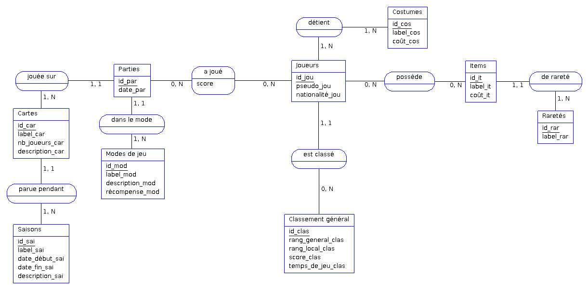
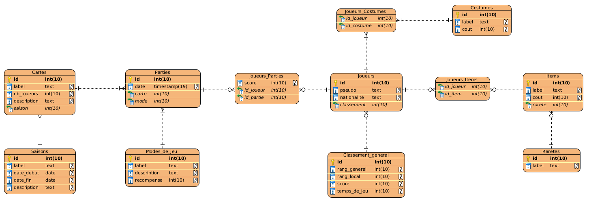

# Conception d'une base de données de jeu vidéo

### Consignes

Vous êtes mandaté pour créer une base de données pour les serveurs d'un jeu vidéo tel que Fall Guys, Among Us ou Golf With Your Friends. Si l'inspiration vous manque, faites au plus simple.

Un jeu nécessite l'enregistrement de joueurs, d'un certain nombre de parties, éventuellement différentes cartes sur lesquelles les parties se déroulent, un score par partie, et un score global permettant d'établir un classement entre joueurs. Les joueurs peuvent éventuellement disposer de skins ou d'items particuliers, et potentiellement être en équipe avec d'autres joueurs.

Concevez cette dernière, étape par étape, en suivant les précèptes de la méthode MERISE. Documentez votre travail en expliquant chacune des étapes de la conception et assurez-vous que votre travail complet soit consultable.

### Points d'attention

Votre travail consistera en la conception et la modélisation des étapes suivantes :

- dictionnaire des données
- MCD
- MLD
- MPD
- script SQL

Décrivez chaque étape et faites des captures d'écrans si cela peut vous simplifier la documentation.

## Proposition de correction

### Dictionnaire de données

| Nom               | Désignation                     | Type | Taille | Entité             |
| ----------------- | ------------------------------- | ---- | ------ | ------------------ |
| score             | score établit lors d'une partie | N    | 10     | a joué             |
| id_car            | identifiant de carte            | N    | 10     | Cartes             |
| label_car         | label de carte                  | A    | -      | Cartes             |
| nb_joueurs_car    | nombre de joueurs maximum       | N    | 10     | Cartes             |
| description_car   | description de carte            | AN   | -      | Cartes             |
| id_clas           | identifiant de classement       | N    | 10     | Classement général |
| rang_general_clas | rang international              | N    | 10     | Classement général |
| rang_local_clas   | rang national                   | N    | 10     | Classement général |
| score_clas        | score global du joueur          | N    | 10     | Classement général |
| temps_de_jeu_clas | temps de jeu total du joueur    | N    | 10     | Classement général |
| id_cos            | identifiant de costume          | N    | 10     | Costumes           |
| label_cos         | nom de costume                  | A    | -      | Costumes           |
| coût_cos          | prix d'un costume               | N    | 10     | Costumes           |
| id_it             | identifiant d'item              | N    | 10     | Items              |
| label_it          | nom de l'item                   | A    | -      | Items              |
| coût_it           | prix d'un item                  | N    | 10     | Items              |
| id_jou            | identifiant de joueur           | N    | 10     | Joueurs            |
| pseudo_jou        | pseudo de joueur                | AN   | -      | Joueurs            |
| nationalité_jou   | nationalité de joueur           | A    | -      | Joueurs            |
| id_mod            | identifiant de mode de jeu      | N    | 10     | Mode de jeu        |
| label_mod         | label de mode de jeu            | A    | -      | Mode de jeu        |
| description_mod   | description de mode de jeu      | AN   | -      | Mode de jeu        |
| récompense_mod    | récompense du vainqueur         | N    | 10     | Mode de jeu        |
| id_par            | identifiant de partie           | N    | 10     | Parties            |
| date_par          | date et heure de la partie      | D    | -      | Parties            |
| id_rar            | identifiant de rareté           | N    | 10     | Raretés            |
| label_rar         | label de rareté                 | A    | -      | Raretés            |
| id_sai            | identifiant de saison           | N    | 10     | Saison             |
| label_sai         | label de saison                 | AN   | -      | Saison             |
| date_début_sai    | date de début de saison         | D    | 10     | Saison             |
| date_fin_sai      | date de fin de saison           | D    | 10     | Saison             |
| description_sai   | description de saison           | AN   | -      | Saison             |

### MCD



### MLD

```
Joueurs (id, pseudo, nationalite, #classement)
Modes_de_jeu (id, label, description, recompense)
Parties (id, date, #carte, #mode)
Items (id, label, cout, #rarete)
Costumes (id, label, cout)
Raretes (id, label)
Saisons (id, label, date_début, date_fin, description)
Classement_general (id, rang_general, rang_local, score, temps_de_jeu)
Cartes (id, label, nb_joueurs, description, #saison)
Joueurs_Costumes (id_joueur, id_costume)
Joueurs_Items (id_joueur, id_item)
Joueurs_Parties (id_joueur, id_partie, score)
```

### MPD



### SQL

```sql
CREATE TABLE Cartes (
    id INT NOT NULL AUTO_INCREMENT,
    label TEXT,
    nb_joueurs INT,
    description TEXT,
    saison INT NOT NULL,
    PRIMARY KEY (id)
);

CREATE TABLE Classement_general (
    id INT NOT NULL AUTO_INCREMENT,
    rang_general INT,
    rang_local INT,
    score INT,
    temps_de_jeu INT,
    PRIMARY KEY (id)
);

CREATE TABLE Costumes (
    id INT NOT NULL AUTO_INCREMENT,
    label TEXT,
    cout INT,
    PRIMARY KEY (id)
);

CREATE TABLE Items (
    id INT NOT NULL AUTO_INCREMENT,
    label TEXT,
    cout INT,
    rarete INT NOT NULL,
    PRIMARY KEY (id)
);

CREATE TABLE Joueurs (
    id INT NOT NULL AUTO_INCREMENT,
    pseudo TEXT,
    nationalité TEXT,
    classement INT NOT NULL,
    PRIMARY KEY (id)
);

CREATE TABLE Joueurs_Costumes (
    id_joueur INT NOT NULL,
    id_costume INT NOT NULL
);

CREATE TABLE Joueurs_Items (
    Joueursid INT NOT NULL,
    Itemsid INT NOT NULL
);

CREATE TABLE Joueurs_Parties (
    score INT,
    id_joueur INT NOT NULL,
    id_partie INT NOT NULL
);

CREATE TABLE Modes_de_jeu (
    id INT NOT NULL AUTO_INCREMENT,
    label TEXT,
    description TEXT,
    recompense INT,
    PRIMARY KEY (id)
);

CREATE TABLE Parties (
    id INT NOT NULL AUTO_INCREMENT,
    `date` TIMESTAMP NULL,
    carte INT NOT NULL,
    `mode` INT NOT NULL,
    PRIMARY KEY (id)
);

CREATE TABLE Raretes (
    id INT NOT NULL AUTO_INCREMENT,
    label TEXT,
    PRIMARY KEY (id)
);

CREATE TABLE Saisons (
    id INT NOT NULL AUTO_INCREMENT,
    label TEXT,
    date_debut DATE,
    date_fin DATE,
    description TEXT,
    PRIMARY KEY (id)
);

ALTER TABLE
    Joueurs_Parties
ADD
    CONSTRAINT FK_Joueurs_Parties_Joueurs FOREIGN KEY (id_joueur) REFERENCES Joueurs (id);

ALTER TABLE
    Joueurs_Parties
ADD
    CONSTRAINT FK_Joueurs_Parties_Parties FOREIGN KEY (id_partie) REFERENCES Parties (id);

ALTER TABLE
    Joueurs_Items
ADD
    CONSTRAINT FK_Joueurs__Items_Joueurs FOREIGN KEY (id_joueur) REFERENCES Joueurs (id);

ALTER TABLE
    Joueurs_Items
ADD
    CONSTRAINT FK_Joueurs_Items_Items FOREIGN KEY (id_item) REFERENCES Items (id);

ALTER TABLE
    Items
ADD
    CONSTRAINT FK_Items_Raretes FOREIGN KEY (rarete) REFERENCES Raretes (id);

ALTER TABLE
    Parties
ADD
    CONSTRAINT FK_Parties_Cartes FOREIGN KEY (carte) REFERENCES Cartes (id);

ALTER TABLE
    Cartes
ADD
    CONSTRAINT FK_Cartes_Saisons FOREIGN KEY (saison) REFERENCES Saisons (id);

ALTER TABLE
    Parties
ADD
    CONSTRAINT FK_Parties_Modes_de_jeu FOREIGN KEY (`mode`) REFERENCES Modes_de_jeu (id);

ALTER TABLE
    Joueurs
ADD
    CONSTRAINT FK_Joueurs_Classement_general FOREIGN KEY (classement) REFERENCES Classement_general (id);

ALTER TABLE
    Joueurs_Costumes
ADD
    CONSTRAINT FK_Joueurs_Costumes_Joueurs FOREIGN KEY (id_joueur) REFERENCES Joueurs (id);

ALTER TABLE
    Joueurs_Costumes
ADD
    CONSTRAINT FK_Joueurs_Costumes_Costumes FOREIGN KEY (id_costume) REFERENCES Costumes (id);
```
