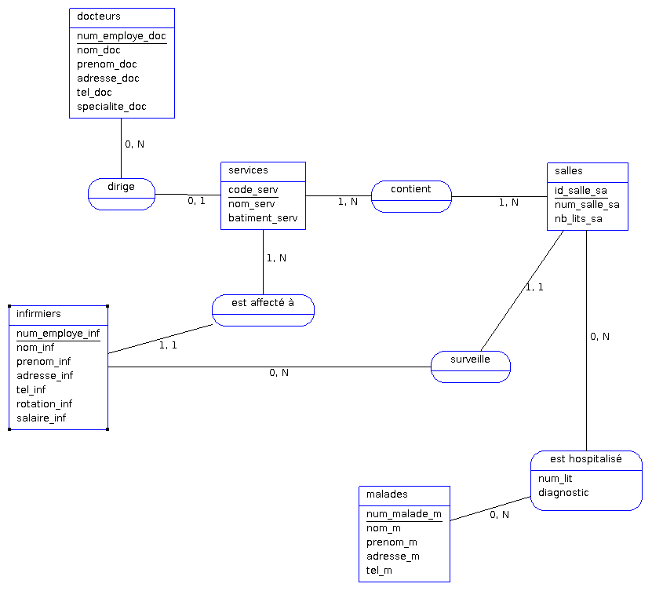
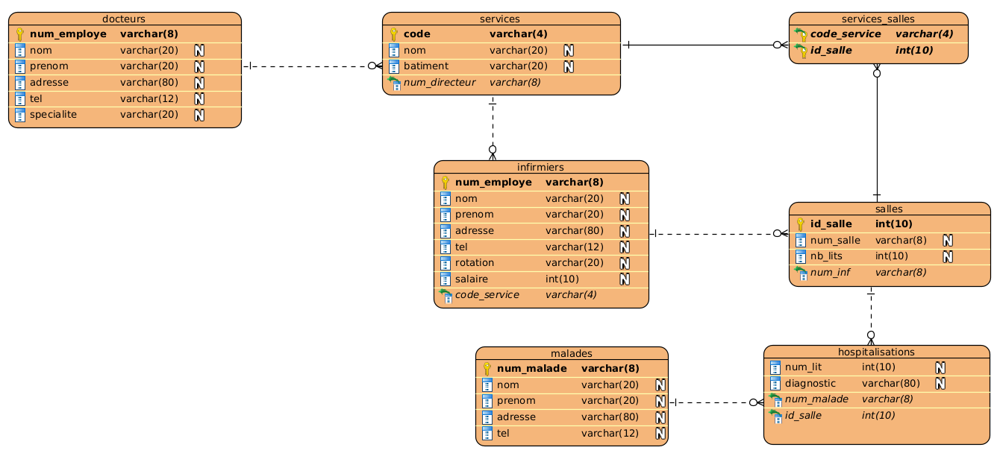

# diginamic-db-conception

### Enoncé

On se propose de modéliser la base de données d'un hôpital. L'analyse de l'existant a dégagé
les informations suivantes :

- L'hôpital a un ensemble d'employés qui sont des docteurs et des infirmières. Chaque
  employé possède un numéro d'employé, un nom, un prénom, une adresse et un numéro
  de téléphone.
- L'hôpital est composé de plusieurs services, pour lesquels on connaît le code, le nom, le
  bâtiment et le directeur, qui est en fait un docteur.
- Chaque service contient plusieurs salles. Une salle est représentée par un numéro, un
  surveillant et le nombre de lits qu'elle possède. Le numéro de salle est local à un service.
- Un surveillant est un infirmier.
- Un infirmier est affecté à un service et à un seul.
- Les docteurs ne sont pas affectés à un service particulier, mais on connaît leur spécialité.
- On connaît aussi pour chaque infirmier sa rotation et son salaire.
- Les malades de l'hôpital sont représentés par un numéro, un nom, un prénom, une
  adresse et un numéro de téléphone.
- Un malade est hospitalisé dans une salle avec un numéro de lit et son diagnostic. Il est
  soigné par un docteur. Au cas où il y a des complications, il peut être transféré dans un
  autre service avec une autre salle.

### Dictionnaire des données

| Nom             | Désignation                                   | Type | Taille | Entité          |
| --------------- | --------------------------------------------- | ---- | ------ | --------------- |
| adresse_doc     | adresse du docteur                            | AN   | 80     | docteurs        |
| adresse_inf     | adresse de l'infirmier/infirmière             | AN   | 80     | infirmiers      |
| adresse_m       | adresse du malade                             | AN   | 80     | malades         |
| batiment_serv   | batiment dans lequel se trouve le service     | AN   | 20     | services        |
| code_serv       | code du service                               | AN   | 4      | services        |
| diagnostic      | diagnostic du malade                          | AN   | 80     | est hospitalisé |
| id_salle_sa     | identifiant de la salle                       | N    | 10     | salles          |
| nb_lits_sa      | nombre de lits dans la salle                  | N    | 10     | salles          |
| nom_doc         | nom du docteur                                | A    | 20     | docteurs        |
| nom_inf         | nom de l'infirmier/infirmière                 | A    | 20     | infirmiers      |
| nom_m           | nom du malade                                 | A    | 20     | malades         |
| nom_serv        | nom du service                                | A    | 20     | services        |
| num_employe_doc | numéro employé du docteur                     | AN   | 8      | docteurs        |
| num_employe_inf | numéro employé de l'infirmier/infirmière      | AN   | 8      | infirmiers      |
| num_lit         | numéro de lit                                 | AN   | 8      | est hospitalisé |
| num_malade_m    | numéro du malade                              | AN   | 8      | malades         |
| num_salle_sa    | numéro de salle                               | AN   | 8      | salles          |
| prenom_doc      | prénom du docteur                             | A    | 20     | docteurs        |
| prenom_inf      | prénom de l'infirmier/infirmière              | A    | 20     | infirmiers      |
| prenom_m        | prénom du malade                              | A    | 20     | malades         |
| rotation_inf    | rotation de l'infirmier/infirmière            | AN   | 20     | infirmiers      |
| salaire_inf     | salaire de l'infirmier/infirmière             | N    | 10     | infirmiers      |
| specialite_doc  | spécialité du docteur                         | A    | 20     | docteurs        |
| tel_doc         | numéro de téléphone du docteur                | AN   | 12     | docteurs        |
| tel_inf         | numéro de téléphone de l'infirmier/infirmière | AN   | 12     | infirmiers      |
| tel_m           | numéro de téléphone du malade                 | AN   | 12     | malades         |

### MCD



### MLD

```
docteurs(num_employe, nom, prenom, adresse, tel, specialite)
services(code, nom, batiment, #num_directeur)
salles(id_salle, num_salle, nb_lits, #num_inf)
malades(num_malade, nom, prenom, adresse, tel)
infirmiers(num_employe, nom, prenom, adresse, tel, rotation, salaire, #code_service)
services_salles(code_service, id_salle)
hospitalisations(num_malade, id_salle, num_lit, diagnostic)
```

### MPD



### SQL

```SQL
CREATE TABLE docteurs (
    num_employe VARCHAR(8) NOT NULL,
    nom VARCHAR(20),
    prenom VARCHAR(20),
    adresse VARCHAR(80),
    tel VARCHAR(12),
    specialite VARCHAR(20),
    PRIMARY KEY (num_employe)
) ENGINE = InnoDB;

CREATE TABLE hospitalisations (
    num_lit INT,
    diagnostic VARCHAR(80),
    num_malade VARCHAR(8) NOT NULL,
    id_salle INT NOT NULL
) ENGINE = InnoDB;

CREATE TABLE infirmiers (
    num_employe VARCHAR(8) NOT NULL,
    nom VARCHAR(20),
    prenom VARCHAR(20),
    adresse VARCHAR(80),
    tel VARCHAR(12),
    rotation VARCHAR(20),
    salaire INT,
    code_service VARCHAR(4) NOT NULL,
    PRIMARY KEY (num_employe)
) ENGINE = InnoDB;

CREATE TABLE malades (
    num_malade VARCHAR(8) NOT NULL,
    nom VARCHAR(20),
    prenom VARCHAR(20),
    adresse VARCHAR(80),
    tel VARCHAR(12),
    PRIMARY KEY (num_malade)
) ENGINE = InnoDB;

CREATE TABLE salles (
    id_salle INT NOT NULL AUTO_INCREMENT,
    num_salle VARCHAR(8),
    nb_lits INT,
    num_inf VARCHAR(8) NOT NULL,
    PRIMARY KEY (id_salle)
) ENGINE = InnoDB;

CREATE TABLE services (
    code VARCHAR(4) NOT NULL,
    nom VARCHAR(20),
    batiment VARCHAR(20),
    directeur VARCHAR(8) NOT NULL,
    PRIMARY KEY (code)
) ENGINE = InnoDB;

CREATE TABLE services_salles (
    code_service VARCHAR(4) NOT NULL,
    id_salle INT NOT NULL,
    PRIMARY KEY (code_service, id_salle)
) ENGINE = InnoDB;

ALTER TABLE
    services
ADD
    CONSTRAINT FK_services_docteurs FOREIGN KEY (directeur) REFERENCES docteurs (num_employe);

ALTER TABLE
    services_salles
ADD
    CONSTRAINT FK_services_salles_services FOREIGN KEY (code_service) REFERENCES services (code);

ALTER TABLE
    services_salles
ADD
    CONSTRAINT FK_services_salles_salles FOREIGN KEY (id_salle) REFERENCES salles (id_salle);

ALTER TABLE
    hospitalisations
ADD
    CONSTRAINT FK_hospitalisations_malades FOREIGN KEY (num_malade) REFERENCES malades (num_malade);

ALTER TABLE
    hospitalisations
ADD
    CONSTRAINT FK_hospitalisations_salles FOREIGN KEY (id_salle) REFERENCES salles (id_salle);

ALTER TABLE
    salles
ADD
    CONSTRAINT FK_salles_infirmiers FOREIGN KEY (num_inf) REFERENCES infirmiers (num_employe);

ALTER TABLE
    infirmiers
ADD
    CONSTRAINT FK_infirmiers_services FOREIGN KEY (code_service) REFERENCES services (code);
```
